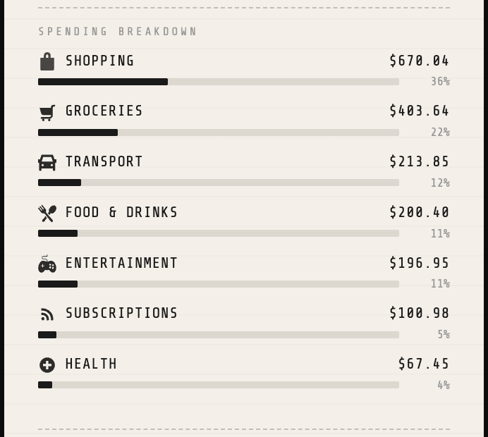
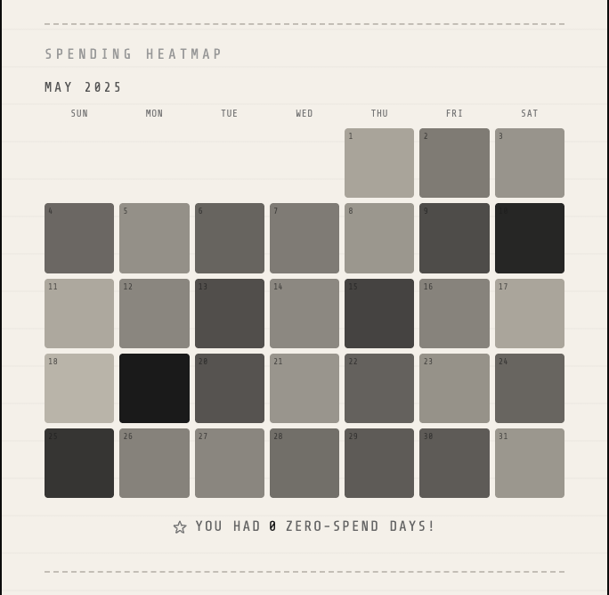

# STATEMONTH

A Chrome extension that turns your monthly bank CSV into a visual spending recap — styled like a thermal receipt, built for people who want to actually understand where their money went.

No account linking. No subscriptions. No data leaving your device. Just drop your CSV and get your month back in a format that's actually worth looking at.

---

## Screenshots

<div align="center">

| Receipt & Stats | Spending Breakdown | Spending Heatmap |
|---|---|---|
|  |  |  |

</div>

---

## Features

- **Thermal receipt design** — spending recap presented as a printable receipt with torn edges, a spending heatmap, category breakdown, and a barcode
- **Auto-categorization** — transactions are sorted into 9 spending categories using keyword matching and establishment-type detection, so even merchants your bank has never heard of get categorized correctly
- **Monthly personality type** — based on your top spending category
- **Spending heatmap** — a mini calendar view where color intensity reflects daily spending
- **Guilty pleasure stat** — the category where you spend the most per individual transaction (not just in total)
- **Projected annual spend** — your monthly total multiplied by 12
- **Biggest splurge** — amount, merchant, and date
- **Most visited merchant** — the place you returned to most often that month
- **Top spending category** — with percentage of total spend
- **Average spend per day**
- **No-spend day counter** — tracks how many days in the month had zero transactions
- **Save as PDF** — opens in a full browser tab and triggers the print dialog automatically
- **Monthly reminder notification** — reminds you on the 2nd of each month to upload last month's CSV
- **Fully offline** — no backend, no API calls, no external data processing

---

## Install

STATEMONTH isn't on the Chrome Web Store yet. To load it manually:

1. Download or clone this repo
2. Open Chrome and navigate to `chrome://extensions`
3. Enable **Developer mode** (toggle in the top right)
4. Click **Load unpacked**
5. Select the `statemonth` folder
6. The STATEMONTH icon will appear in your Chrome toolbar

> After making any changes to the source files, click the **↺ reload** button on the extensions page to apply them.

---

## How to Use

1. **Export your CSV** — log into your bank and download last month's transactions as a CSV file (see instructions per bank below)
2. **Click the extension icon** in Chrome
3. **Upload your CSV** — drag and drop it onto the upload zone, or click to browse
4. **View your receipt** — scroll through your monthly breakdown, heatmap, and stats
5. **Save as PDF** if you want to keep or share it

Your most recent receipt is saved locally, so it will still be there the next time you open the extension. Click **↺ NEW CSV** to upload a new month.

---

## Supported Banks

STATEMONTH parses standard CSV exports from all major US banks. Here's how to download yours:

| Bank | Steps |
|---|---|
| **Chase** | Sign in → Accounts → *Activity* tab → *Download* → Select date range → CSV |
| **Bank of America** | Sign in → Accounts → *Download* → Choose date range → File type: CSV |
| **Capital One** | Sign in → Transactions → *Download* → All Transactions → CSV |
| **Wells Fargo** | Sign in → Accounts → *Download Account Activity* → CSV |
| **US Bank** | Sign in → My Accounts → *Transactions* → *Download* → CSV |

Most other banks that export a standard `Date / Description / Amount` CSV format should work as well. If your bank's export isn't parsing correctly, feel free to open an issue.

---

## Tech Stack

```
Platform     Chrome Extension (Manifest V3)
Frontend     Vanilla HTML, CSS, JavaScript — no frameworks
Fonts        Bebas Neue, Share Tech Mono, DM Sans via Google Fonts
Icons        Custom SVGs per spending category
Storage      chrome.storage.local
Alerts       chrome.alarms + chrome.notifications
PDF Export   chrome.tabs + window.print() in a full tab
```

No build step. No bundler. No dependencies.

---

## Privacy

**Your financial data never leaves your device.**

- CSV files are read entirely in the browser and never transmitted anywhere
- Parsed transaction data is stored in `chrome.storage.local`, which is sandboxed to the extension and lives only on your machine
- There are no external requests beyond loading Google Fonts for the receipt UI
- There is no server, no database, and no third party involved at any point

---

## About the Project

I'm a data science student with a minor in accounting, and STATEMONTH came out of wanting to build something that actually combined both sides of what I'm studying — the programming and data analysis skills from my major, and the financial literacy side from my accounting coursework.

I also wanted to use this project to explore vibe coding more seriously and get comfortable building something complete and polished from scratch using that workflow.

The other motivation was practical: a lot of budgeting tools are built for people who already have their finances figured out, or they require linking your bank account to a third-party service. I wanted something simpler — a tool that college students could actually use, that doesn't ask for any account access, and that makes monthly spending feel less abstract and more visual. STATEMONTH is that.

---

*statemonth.io*
